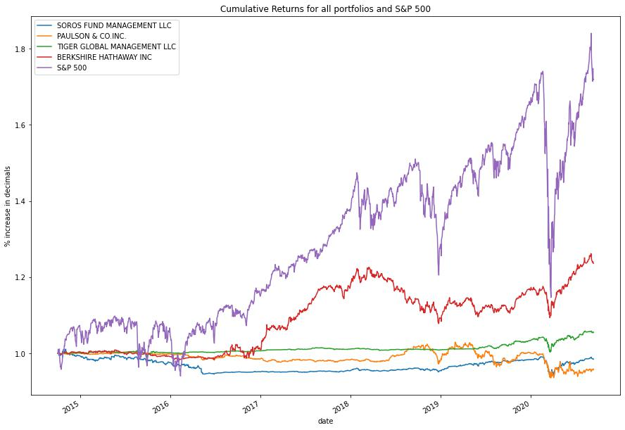
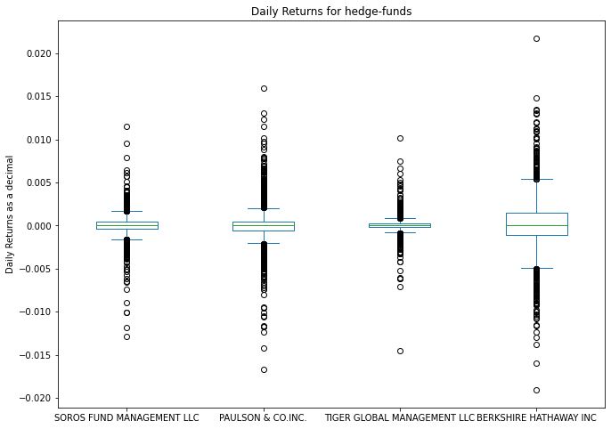
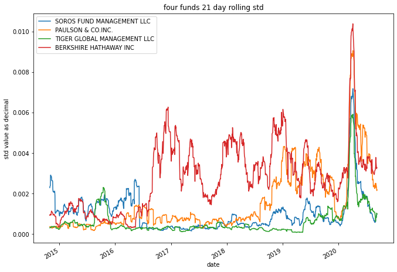
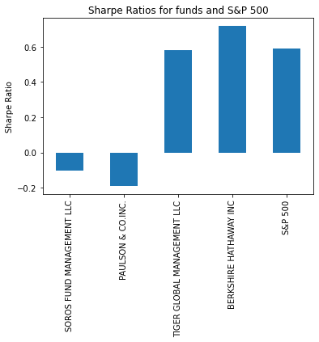

# Quantitative Analysis with Pandas
Challenge 4 for Fintech Bootcamp through UC Berkeley - Quantitative analysis of S&P500 and 4 hedge funds performance over 6 years, from 2014-2020. Using Pandas with a jupyter notebook (`risk_return_analysis.ipynb`) to get Sharpe ratio, beta, std, var, and cov among other values to perform analysis on the different funds and see which was a better investment during the time period. 

--- 
In this Analysis I started by importing the data and cleaning up the data frame. Once i got it to a working condition I quickly analyzed the performance of the various stocks and got a cumulative return over the whole timeframe. The results can be seen in the chart below - 

Here we can clearly that the S&P 500 was a clear winner over the whole timeframe in terms of returns. After learning this i went ahead and started to analyze the volatility to see what funds were the most/least volatile and how they compared to the S&P 500. 

Again, the S&P 500 was clearly the most volatile so i went ahead and ignored the S&P 500 and created a box plot showing the daily returns for the remaining four hedge funds. The results can be seen in the chart below. 

In the chart above we can see that the daily returns for the hedge funds are in a range of -.02 to .02, or in English, -2% to 2%. With most of the data falling right in the middle around 0.000. Here we can get a sense of how volatile the funds are compared to each other. We can clearly see that Berkshire has the biggest mean range (middle box) and the biggest tails, meaning its values are spread out more compared to that off the other three funds. This also makes sense considering that Berkshire had the biggest cumulative returns out of the four funds, meaning its most likely also more volatile as volatility goes both to the upside and the downside. 

After finding the volatility the next thing was to start to analyze the risk. I did this by finding the standard deviation (std). Which measures how much a datapoint moves from the mean. The higher the std, the more a dataset moves around, whereas a lower std means that a dataset's values are closer together vs being further apart. To put these numbers into something more understandable I calculated the annualized std values (multiplying std by 252, amount of trading days) and then a rolling 21-day value to get the average over a rolling 21 days. I then went ahead and plotted the 21-day rolling std value for all four funds to get an idea of how they compare. The results can be seen in the graph below.

In the 21-day rolling STD chart we can again see that Berkshire is the most volatile fund, with Paulson and Co also having its fair share of volatile price action. All the funds experienced heightened volatile and deviated further from their respected means in 2020 during the whole covid situation which is very visible in this chart. 

After calculating the risk associated with each fund, the next thing I did was calculate its risk-return profile. I did this by utilizing the Sharpe ratio to see what the best risk-return fund would be to invest in. We can see the results in the graph below. 

In the above graph we can again see that Berkshire Hathaway has the best risk-return profile with a Sharpe ratio of 0.71. The worst risk-return according to this chart would be Paulsen and Co being in the negative territory with a -0.18 value. 

Finally, the result of all this would be that out of the four funds I analyzed, the best risk-return option would have been to invest in Berkshire Hathaway, unless you wanted to put your money into the S&P 500. 

--- 

## Contributors

[Robin Thorsen](https://www.linkedin.com/in/robin-thorsen-079819120/) was the main developer/analyst working on this project.  

Best reached via email - robinbthorsen@gmail.com

---

## License

Apache 2.0 public License applied, feel free to clone and fork and use and reach out if you have questions.
